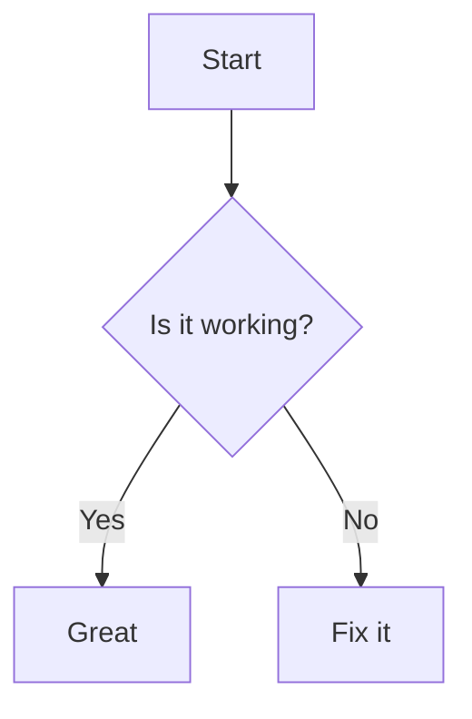

# Markvix Sample Docs

This is a quick smoke-test document for Markvix.

- Basic list item 1
- Basic list item 2

## Code Block

```ts
export function hello(name: string) {
  return `Hello, ${name}`
}
```

## Mermaid Diagram



## Table

| Feature | Status |
| --- | --- |
| Markdown | OK |
| Mermaid | OK |

